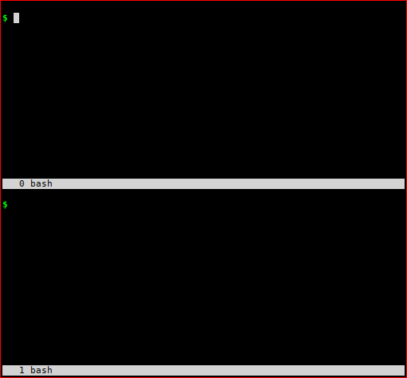

[](https://travis-ci.org/earldouglas/codedown)
[](https://coveralls.io/github/earldouglas/codedown?branch=master)

Codedown is a little utility to extract code blocks from Markdown files.

Inspired by [literate Haskell][1], codedown can be used to:

* Validate the correctness of code embedded in Markdown
* Run code embedded in Markdown
* Ship code and Markdown together in harmony



## Quicker start

To skip installing codedown locally, try [codedown-web][2].

## Quick start

Install codedown:

```
$ npm install -g codedown
```

Run codedown:

```
$ codedown
usage: codedown <lang>
ex: codedown haskell
```

Codedown reads Markdown from stin, extracts the code blocks designated
as language `<lang>`, and outputs them to stdout.

You can pipe the output of codedown to a language interpreter:

```
$ cat README.md | codedown haskell | runhaskell
42
```

```
$ cat README.md | codedown javascript | node
42
```

```
$ cat README.md | codedown scala | scala
scala> val x = 42
x: Int = 42
scala> println(x)
42
scala> :quit
```

## Examples

This readme is a Markdown file, so we can use codedown to extract code
from it.

In the following code blocks, let's set `x` to 42 in different
languages:

*Haskell:*

```haskell
x :: Int
x = 42
```

*JavaScript:*

```javascript
var x = 42;
```

*Scala:*

```scala
val x = 42
```

Now let's print `x` it to stdout in different languages.

This time, the code blocks are nested within an unordered list:

* *Haskell:*

  ```haskell
  main :: IO ()
  main = putStrLn $ show x
  ```

* *JavaScript:*

  ```javascript
  console.log(x);
  ```

* *Scala:*

  ```scala
  println(x)
  ```

[1]: https://wiki.haskell.org/Literate_programming
[2]: https://github.com/earldouglas/codedown-web
